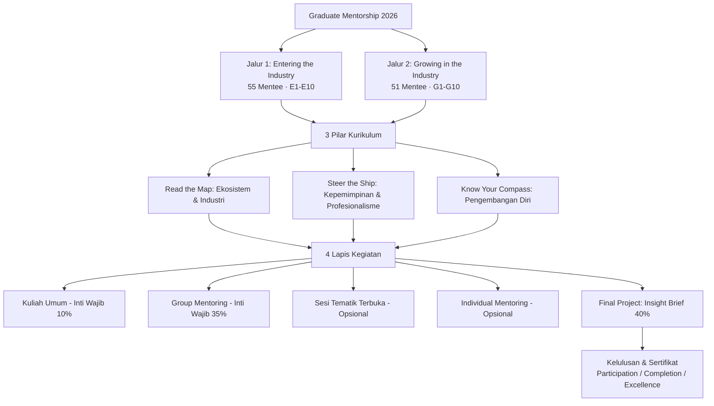

# ILUNI GPTK FTUI — Graduate Mentorship 2026

> **"Connecting AMBITION with Leadership EXCELLENCE"**  
> *Official web portal and canonical interactive program booklet for the Graduate Mentorship 2026 program by Ikatan Alumni Departemen Teknik Kimia Fakultas Teknik Universitas Indonesia (ILUNI GPTK FTUI).*

---

## 📌 Codebase Purpose & Goals

This repository powers the official web application for **Graduate Mentorship 2026**, an intensive, 3-month, 100% free structured career development and mentorship program connecting DTK UI young alumni (Batches 2020–2022) with senior alumni leaders across global industries.

### Core Goals
1. **High-Impact Dual-Audience Landing Page (`/`)**: Dynamically shifts copy, color accents, objectives, eligibility, and action triggers between **Mentees** (Fresh graduates & early career) and **Mentors** (5+ years experienced alumni).
2. **Canonical Single Source of Truth (`/booklet`)**: Houses the complete 13-section interactive program guide (Tracks, Pillars, Activity Layers, 20 Group Pairings, Thematic Sessions, Timeline, Final Project Insight Brief, Assessment Schema, Platform Setup, and FAQs).
3. **Print & Markdown Export Readiness**: Features scoped print stylesheets (`@media print` for clean zero-chrome booklet exports) and dynamic GitHub-Flavored Markdown generation for instant clipboard copying and offline dissemination.
4. **100% Grounded Content**: Zero placeholders or invented data. Every statistic, mentor assignment, rubric weight, schedule milestone, and contact detail is tied directly to typed datasets verified by the ILUNI GPTK FTUI organizing committee.

---

## 🏢 Program Architecture & Native Shape

The program is structured as a **Dual-Track Mentorship Pipeline** designed to address specific career transition stages:



### Key Program Metrics
| Metric | Value | Detail |
|:---|:---:|:---|
| **Mentees Enrolled** | **106** | 55 Entering Track + 51 Growing Track (DTK UI 2020–2022) |
| **Mentors Joined** | **42** | 20 Anchor Mentors + 22 Co-Mentors |
| **Mentoring Groups** | **20** | 10 Entering (E1–E10) + 10 Growing (G1–G10) |
| **Industry Tracks** | **5** | Oil & Gas, ESG & Decarbonization, FMCG & Supply Chain, Consultancy, Finance/Business |
| **Duration** | **3 Bulan** | 20 Agustus 2026 – 20 November 2026 |
| **Program Cost** | **Gratis** | 100% gratis untuk seluruh peserta dan mentor |

---

## 🗂️ Critical Files & Directory Structure

```
ilunigptkgm2026-info-website/
├── app/
│   ├── layout.tsx              # Root HTML/Body setup, font variables, and SEO metadata
│   ├── globals.css             # Tailwind v4 theme, brand color tokens, typography & print CSS
│   ├── page.tsx                # Landing page route with Suspense wrapper
│   └── booklet/
│       └── page.tsx            # Canonical 13-section booklet route
├── components/
│   ├── audience-context.tsx    # React Context provider & useAudience hook (mentee | mentor)
│   ├── landing-page.tsx        # Composition root for marketing sections
│   ├── shapes.tsx              # Bespoke SVG brand geometric badges & icons
│   ├── logo.tsx                # Program brand mark component
│   ├── icon.tsx                # Dynamic Lucide icon lookup dictionary
│   ├── sections/               # Marketing Landing Page modular sections
│   │   ├── hero.tsx            # Dual-audience bento hero with audience switcher tabs
│   │   ├── companies.tsx       # Partner & mentor alumni company marquee/grid
│   │   ├── about.tsx           # Program background & 3-pillar curriculum overview
│   │   ├── benefits.tsx        # Audience-targeted benefits cards
│   │   ├── roles.tsx           # Eligibility and responsibilities comparison
│   │   ├── industries.tsx      # 5 Industry focus areas & participant breakdown
│   │   ├── pairing.tsx         # 20 Mentoring groups ratio & Anchor + Co-Mentor model
│   │   ├── mechanism.tsx       # Format, cadence, and operating mechanics
│   │   ├── timeline.tsx        # Program milestone roadmap
│   │   ├── faq.tsx             # Interactive categorised FAQ accordion
│   │   ├── cta.tsx             # Final call-to-action cards
│   │   └── footer.tsx          # Official committee links, contacts, and copyright
│   ├── booklet/                # 13 Modular components for the Canonical Booklet
│   │   ├── booklet-page.tsx    # Layout wrapper with sticky dual-mode Table of Contents
│   │   ├── header.tsx          # Booklet top masthead & quick action buttons
│   │   ├── toc.tsx             # Responsive desktop sidebar & mobile accordion TOC
│   │   ├── opening.tsx         # Bagian 1: Pembuka, visi, dan statistik ringkas
│   │   ├── tracks.tsx          # Bagian 2: Dua jalur peserta (Entering vs Growing)
│   │   ├── pillars.tsx         # Bagian 3: Tiga pilar kurikulum program
│   │   ├── activity-layers.tsx # Bagian 4: Empat lapis kegiatan & bobot penilaian
│   │   ├── mentor-roles.tsx    # Bagian 5: Struktur peran Anchor Mentor & Co-Mentor
│   │   ├── groups.tsx          # Bagian 6: Peta lengkap 20 kelompok (G1–G10 & E1–E10)
│   │   ├── cross-group-sessions.tsx # Bagian 7: Sesi tematik terbuka (LN & S2)
│   │   ├── timeline.tsx        # Bagian 8: Linimasa resmi pelaksanaan program
│   │   ├── insight-brief.tsx   # Bagian 9: Panduan & etika Final Project Insight Brief
│   │   ├── assessment.tsx      # Bagian 10: Komponen penilaian & 3 tier sertifikat
│   │   ├── platform.tsx        # Bagian 11: Platform operasional & Group Coordinator
│   │   ├── faq.tsx             # Bagian 12: Tanya jawab teknis peserta
│   │   ├── closing.tsx         # Bagian 13: Penutup & tagar resmi
│   │   ├── copy-page-button.tsx# Modal exporter to copy full or partial markdown
│   │   └── markdown-modal.tsx  # Dynamic markdown preview and clipboard utility
│   └── ui/                     # Shadcn UI primitives built on Base-UI
├── lib/
│   ├── data.ts                 # Single source of truth for landing page copy & configs
│   ├── booklet-data.ts         # Single typed source of truth for 13 booklet sections
│   ├── booklet-markdown.ts     # Dynamic Markdown compiler for the complete booklet
│   └── utils.ts                # Tailwind merge and class variance utilities
└── public/                     # Static brand assets, logos, and icons
```

---

## 🎨 Visual Identity & Design System

The application employs a refined **Neo-Brutalist Editorial** design system tailored for engineering academia and corporate executive professionalism:

### Color Palette Tokens
- **Cream Canvas (`--color-cream` / `#f6f5ec`)**: Warm, high-legibility base background.
- **Brand Red (`--color-brand-red` / `#f81919`)**: Primary accent for the **Mentee Track** and high-energy highlights.
- **Brand Blue (`--color-brand-blue` / `#004aad`)**: Primary accent for the **Mentor Track** and corporate authority.
- **Ink Black (`--color-ink` / `#000000`)**: Deep contrast borders (`border-2 border-ink`), high-contrast typography, and hard shadows.

### Typography
- **Headings & Display (`--font-heading`)**: `Space Grotesk` (tight letter spacing `-0.01em`, uppercase tracking).
- **Body & Data (`--font-sans`)**: `Inter` (neutral, ultra-readable across dense tables and rubrics).

### Custom Geometric Badges (`components/shapes.tsx`)
- `Burst`: 12-point burst mark representing leadership impact.
- `GearStar`: Kinetic rotating gear representing chemical engineering processes.
- `FourPointStar`: Precision 4-point star for key takeaways and benefits.
- `Quatrefoil`: 4-lobed architectural badge for structural frameworks.
- `Pinwheel`: Multi-directional pinwheel for fresh perspectives.
- `TriangleArrow`: Directional growth chevron.
- `IluniRoofLogo`: Geometric representation of the FTUI Makara house emblem.

---

## 🛠️ Technology Stack & Framework Rules

- **Framework**: [Next.js](https://nextjs.org) `16.2.9` (App Router)
- **Library**: [React](https://react.dev) `19.2.4`
- **Styling**: [Tailwind CSS v4](https://tailwindcss.com) + `@tailwindcss/postcss`
- **Components**: [shadcn/ui](https://ui.shadcn.com) (`base-nova` style, `@base-ui/react` primitives)
- **Icons**: [Lucide React](https://lucide.dev)
- **TypeScript**: `5.x` with strict type checking

> ⚠️ **Next.js Note**: `package.json` pins Next.js 16. The UI primitives use `@base-ui/react` rather than Radix. The `Button` component does not support `asChild`; for link-styled buttons, use `buttonVariants({ ... })` on native `<Link>` / `<a>` elements.

---

## 🚀 Getting Started

### 1. Install Dependencies
```bash
npm install
```

### 2. Run Development Server
```bash
npm run dev
```
Open [http://localhost:3000](http://localhost:3000) to view the Landing Page or [http://localhost:3000/booklet](http://localhost:3000/booklet) for the Booklet.

### 3. Production Build & Linting
```bash
npm run lint
npm run build
npm run start
```

---

## 📞 Program Contacts & Official Links

- **Mentee Registration**: [bit.ly/RegistrationMentorshipILUNIGPTKUI](https://bit.ly/RegistrationMentorshipILUNIGPTKUI)
- **Mentor Registration**: [bit.ly/RegistrationMentorILUNIGPTKUI](https://bit.ly/RegistrationMentorILUNIGPTKUI)
- **Official Website**: [bit.ly/GraduateMentorshipWebsite](https://bit.ly/GraduateMentorshipWebsite)
- **Panitia Contacts**:
  - Ivan Prasetyadi (`081398479340`)
  - Gyman Mardhiana (`085795253394`)
  - Arif Al-Fath (`081283839720`)

**ILUNI GPTK FTUI 2026** — *#ILUNIGPTKFTUI #GraduateMentorship2026 #GreatGraduates #ValuableLeaders*
